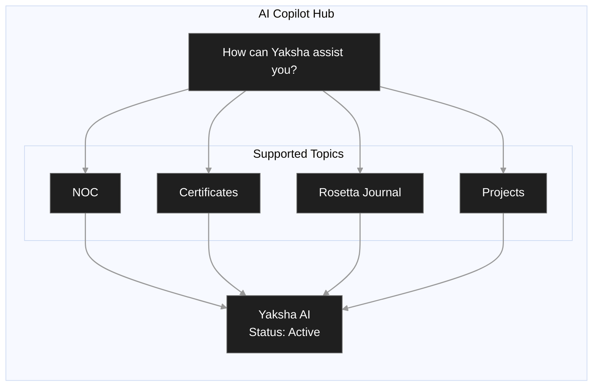
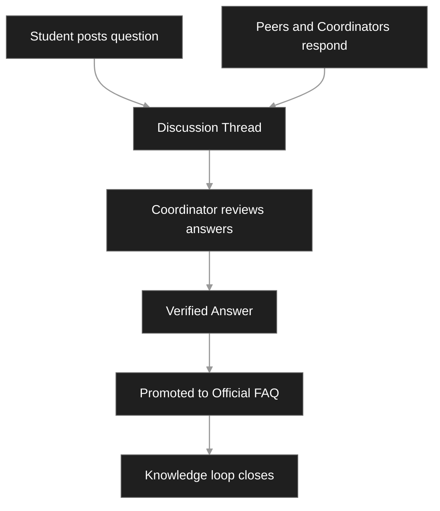
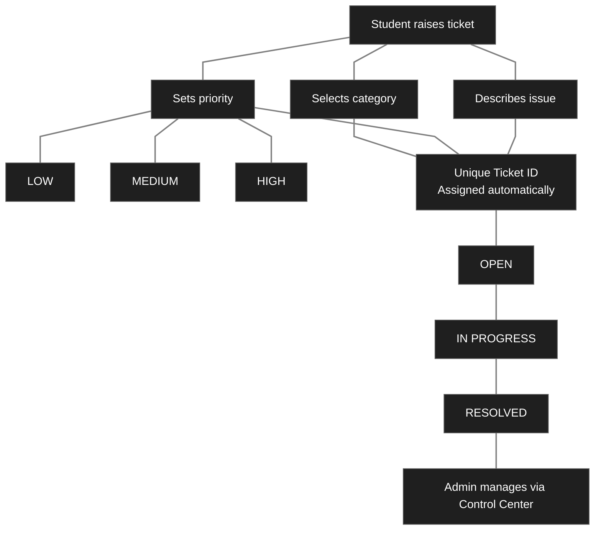
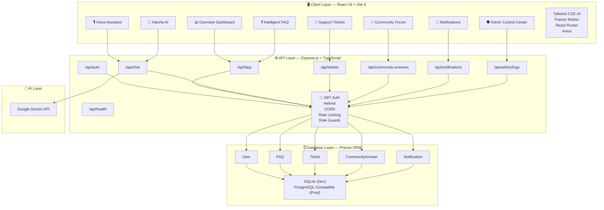

<div align="center">

<picture>
  <source media="(prefers-color-scheme: dark)" srcset="https://capsule-render.vercel.app/api?type=waving&color=0:6C3BF5,50:A855F7,100:06B6D4&height=200&section=header&text=Vicharanashala&fontSize=62&fontColor=ffffff&fontAlignY=38&desc=Support%20Portal%20%C2%B7%20IIT%20Ropar&descSize=20&descAlignY=60&descColor=E2D9FF&animation=fadeIn" />
  
</picture>

<br/>


<br/><br/>

<a href="#"></a>
&nbsp;
<a href="#"></a>
&nbsp;
<a href="#"></a>
&nbsp;
<a href="#"></a>

<br/><br/>

[](https://www.typescriptlang.org/)
[](https://react.dev/)
[](https://expressjs.com/)
[](https://www.prisma.io/)
[](https://ai.google.dev/)
[](https://tailwindcss.com/)
[](https://www.framer.com/motion/)
[](https://vitejs.dev/)

<br/>

<table>
<tr>
<td align="center"><a href="#-overview"><b>📌 Overview</b></a></td>
<td align="center"><a href="#-features"><b>✦ Features</b></a></td>
<td align="center"><a href="#-system-architecture"><b>🗺️ Architecture</b></a></td>
<td align="center"><a href="#-getting-started"><b>🚀 Quick Start</b></a></td>
<td align="center"><a href="#-api-reference"><b>🔌 API Docs</b></a></td>
<td align="center"><a href="#-security"><b>🔒 Security</b></a></td>
<td align="center"><a href="#-deployment"><b>🌐 Deploy</b></a></td>
</tr>
</table>

<br/>

</div>

---

## 📌 Overview


The **Vicharanashala Support Portal** is a production-grade, full-stack web platform built exclusively for interns at **IIT Ropar's Vicharanashala Internship Program** — a single intelligent hub where every question gets answered, every issue gets resolved, and every intern stays informed throughout their program cycle.

At its core lives **Yaksha** — a 3D AI copilot powered by Google Gemini that understands Vicharanashala-specific context end-to-end: NOC validation, certificate workflows, Rosetta Journal requirements, and team formation. Around Yaksha is a complete ecosystem of **18 purpose-built features** — a multi-language FAQ engine, a dedicated voice assistant, a threaded community forum, a smart bookmark system, a priority-based ticket system, coordinator-verified answers, and a full admin control center.

Built with strict TypeScript, role-based JWT authentication, rate limiting, CSP headers, and a type-safe ORM — this is a **production system designed to serve real students across real internship cycles**, not a demo.

<br clear="right"/>

---


## ✦ Features
* **Yaksha AI Assistant** – Get instant, personalized answers for internship-related queries.
* **Voice Support** – Interact with Yaksha using voice commands for hands-free assistance.
* **Multi-Language Translation** – Translate FAQs into English, Hindi, Punjabi, and Spanish.
* **Smart FAQ System** – Explore categorized FAQs with search, sorting, and popularity filters.
* **Bookmarks & Quick Revisit** – Save important FAQs and continue from where you left off.
* **Category-Based Navigation** – Browse topics like Internship, NOC, Certificates, Rosetta Journal, and Projects.
* **FAQ Insights** – View category-wise FAQ counts and discover trending topics easily.
* **Community Discussion Forum** – Ask questions, join discussions, and learn from peers.
* **Community Contributions** – Submit answers and help build a collaborative knowledge base.
* **Coordinator-Verified Answers** – Promote trusted community responses into official FAQs.
* **Support Ticket System** – Raise, track, and manage issues with priorities and unique ticket IDs.
* **Real-Time Notifications** – Stay updated on ticket status, replies, and important announcements.
* **Admin Control Center** – Manage FAQs, users, tickets, analytics, and moderation from one dashboard.


<br/>


---

### Yaksha AI Copilot Hub



</div>

Yaksha is the intelligence layer of the entire portal. A conversational AI assistant embedded into the dashboard with a live 3D avatar, active status indicator, and deep FAQ integration. It understands Vicharanashala-specific context end-to-end.

| Capability | Detail |
|:---|:---|
| 🧠 **AI Engine** | Google Gemini API — runs **entirely server-side**, key never reaches the browser |
| 🎙️ **Input Modes** | Text and voice — built-in microphone integration |
| 🔗 **FAQ Integration** | Every FAQ card has an **"Ask AI About This"** button for in-context follow-ups |
| ⚡ **Rate Limiting** | 15 messages / minute — fair, reliable access across the full cohort |
| 🎭 **UI Presence** | Animated 3D robot in the AI Copilot Hub with live `3D YAKSHA ACTIVE` tag |

<br/>

---

### 🎙️ Voice Assistant

A dedicated voice interface — its own section in the navbar, separate from the chat.

- Speak queries directly; Yaksha processes and responds with spoken answers
- Designed for speed: no typing, no friction, instant information access
- Built on the browser's microphone API with explicit permission handling

<br/>

---

###  Intelligent FAQ System

Not a static page. A fully intelligent, multi-layered knowledge base purpose-built for internship workflows.

<br/>

<details open>
<summary><b>📂 Browse &amp; Discover</b></summary>
<br/>

| Feature | Description |
|:---|:---|
| **Category Navigation** | FAQs split into: *About Internship · NOC · Certificates · Rosetta Journal · Projects* |
| **FAQ Count Indicators** | Every category shows the exact number of available FAQs at a glance |
| **Smart Sorting** | Toggle between **Index** (by category) and **Popular** (by trending usage) |
| **Trending FAQ Counter** | Live navbar badge tracking the number of currently trending queries |

</details>

<details open>
<summary><b>📖 Read &amp; Save</b></summary>
<br/>

| Feature | Description |
|:---|:---|
| **Multi-language Translation** | Translate any answer into **English · Hindi · Punjabi · Spanish** — inline, within the card |
| **Bookmark FAQs** | One-click save from any FAQ card to a personal bookmark list |
| **My Saved FAQs** | Dedicated section surfacing all bookmarked entries for fast future access |
| **Quick Revisit** | Portal auto-tracks viewed FAQs — students continue exactly where they left off |

</details>

<details open>
<summary><b>💡 Ask &amp; Clarify</b></summary>
<br/>

| Feature | Description |
|:---|:---|
| **Ask Yaksha AI (per FAQ)** | Direct AI button on every card — scoped to that topic, no context switching |

</details>

<br/>

---

### Community Discussion Workflow



| Feature | Description |
|:---|:---|
| **Post Questions** | Post directly from the FAQ portal when information can't be found |
| **Thread-based Queries** | Each question spawns a structured discussion thread |
| **Community Contributions** | Students submit answers to existing FAQs for admin review |
| **Verified Answers** | Coordinators promote accurate discussions to official FAQ status |

<br/>

---

### Support Ticket Workflow


<br>


---

### 🔔 Notification Center

Students are never out of the loop.

- In-app notifications scoped per user — only what's relevant to you
- Triggers on: ticket status changes · coordinator replies · verified answer promotions

<br/>

---

### 🛡️ Admin Control Center

Complete operational visibility for program coordinators — all from one protected tab.

| Capability | Detail |
|:---|:---|
| 📊 **Live Stats** | Total users · open tickets · FAQ count · community answers |
| 👥 **Intern Roster** | Name · email · student ID · college · role · verification · contribution score |
| ✔️ **Moderation** | Review community submissions · promote verified answers to official FAQs |
| 🔐 **Access Control** | JWT + `requireAdmin` guard — zero unauthorized access |

<br/>

---

## 🗺️ Architecture & Data Flow



---

---

## 🛠️ Tech Stack

<div align="center">

| Layer | Technology | Purpose |
|:---|:---|:---|
| **UI Framework** | React 19 | Concurrent rendering, modern hooks architecture |
| **Build Tool** | Vite 6 | Sub-second HMR in dev · optimized prod bundles |
| **Styling** | Tailwind CSS v4 | Utility-first dark theme applied system-wide |
| **Animation** | Framer Motion | Page transitions · 3D Yaksha avatar · micro-interactions |
| **Backend** | Express.js 4 + TypeScript | Typed REST API with full middleware control |
| **AI Engine** | Google Gemini (`@google/genai ^2.4.0`) | Yaksha — server-side only, key never exposed |
| **ORM** | Prisma | Type-safe queries · schema-as-code · migration support |
| **Auth** | JSON Web Tokens + bcrypt | Stateless auth · zero plaintext password storage |
| **Security** | Helmet + CORS + express-rate-limit | HTTP hardening · CSP · abuse prevention |
| **Backend Build** | esbuild | Single-file backend bundle for production |
| **Dev Runtime** | tsx | Run TypeScript directly in Node — zero compile step |

</div>

<br/>

---

## 📁 Project Structure

```
IIT-ROPAR/
│
├── 📂 prisma/
│   ├── schema.prisma            ← User · Ticket · FAQ · CommunityAnswer models
│   └── seed.ts                  ← Initial database seed data
│
├── 📂 src/
│   │
│   ├── 📂 backend/
│   │   ├── 📂 routes/
│   │   │   ├── authRoutes.ts             ← /api/auth
│   │   │   ├── ticketRoutes.ts           ← /api/tickets
│   │   │   ├── faqRoutes.ts              ← /api/faqs
│   │   │   ├── chatRoutes.ts             ← /api/chat  [ Yaksha lives here ]
│   │   │   ├── communityAnswerRoutes.ts  ← /api/community-answers
│   │   │   └── notificationRoutes.ts    ← /api/notifications
│   │   │
│   │   ├── 📂 middleware/
│   │   │   └── authMiddleware.ts         ← authenticateToken · requireAdmin
│   │   │
│   │   └── 📂 services/
│   │       └── db.ts                     ← Prisma client singleton
│   │
│   └── 📂 frontend/
│       ├── pages/                        ← Overview · FAQ · Chat · Dashboard · Admin
│       ├── components/                   ← FAQ cards · Ticket forms · Yaksha widget
│       └── hooks/                        ← Auth · Notifications · Bookmarks
│
├── server.ts                    ← Express app entry point
├── vite.config.ts               ← Vite + Express dev middleware config
├── tsconfig.json
├── .env.example
└── package.json
```

<br/>

---

## 🚀 Getting Started

### Prerequisites

Before you begin, ensure you have the following installed:

| Requirement | Version | Source |
|--------------|----------|---------|
| Node.js | v18 or later | [nodejs.org](https://nodejs.org/) |
| npm | v9 or later | Bundled with Node.js |
| Gemini API Key | Free tier available | [Google AI Studio](https://aistudio.google.com/) |

> **Note:** npm is automatically installed with Node.js.

<br/>

### Step 1 &nbsp;·&nbsp; Clone

```bash
git clone https://github.com/tarun-1607/IIT-ROPAR.git
cd IIT-ROPAR
```

### Step 2 &nbsp;·&nbsp; Install

```bash
npm install
```

### Step 3 &nbsp;·&nbsp; Configure environment

```bash
cp .env.example .env.local
```

```env
# ─────────────────────────────────────────────────────────────────
#  Required
# ─────────────────────────────────────────────────────────────────

# Powers Yaksha AI — server-side only, NEVER sent to the browser
GEMINI_API_KEY="your_gemini_api_key_here"

# Base URL for the application
APP_URL="http://localhost:3000"

# ─────────────────────────────────────────────────────────────────
#  Optional
# ─────────────────────────────────────────────────────────────────
NODE_ENV="development"   # Set to "production" for prod builds
PORT=3000
```

### Step 4 &nbsp;·&nbsp; Initialize database

```bash
npm run setup
```

> Runs `prisma db push` (creates schema) then `prisma/seed.ts` (populates initial data).  
> **Run once on first setup only.**

### Step 5 &nbsp;·&nbsp; Launch

```bash
npm run dev
```

Open **[http://localhost:3000](http://localhost:3000)** and the full portal is live. ✦

<br/>

---

## 📜 Scripts

<div align="center">

| Script | Description |
|:---|:---|
| `npm run dev` | Dev server with Vite hot module reload |
| `npm run build` | Build frontend (Vite) + backend (esbuild) → `dist/` |
| `npm start` | Run the production build from `dist/server.cjs` |
| `npm run setup` | **First-time only.** Push schema + seed the database |
| `npm run db:push` | Apply Prisma schema changes to the database |
| `npm run db:seed` | Re-run the database seed script |
| `npm run lint` | TypeScript type-check across the full codebase (no emit) |
| `npm run clean` | Remove `dist/` and all build artifacts |

</div>

<br/>

---

## 🔌 API Reference

All routes are prefixed `/api`. Protected routes require:

```http
Authorization: Bearer <your_jwt_token>
```

<br/>

<details open>
<summary><b>🔑 Authentication &nbsp;·&nbsp; <code>/api/auth</code> &nbsp;·&nbsp; Rate limited: 100 req / 15 min</b></summary>
<br/>

| Method | Endpoint | Description |
|:---:|:---|:---|
| `POST` | `/api/auth/register` | Register a new student account |
| `POST` | `/api/auth/login` | Authenticate and receive a signed JWT |

</details>

<br/>

<details open>
<summary><b>🎫 Tickets &nbsp;·&nbsp; <code>/api/tickets</code> &nbsp;·&nbsp; 🔐 JWT required</b></summary>
<br/>

| Method | Endpoint | Access | Description |
|:---:|:---|:---:|:---|
| `GET` | `/api/tickets` | Student / Admin | Own tickets (student) · Full queue (admin) |
| `POST` | `/api/tickets` | Student | Raise ticket with category + priority |
| `GET` | `/api/tickets/:id` | Student / Admin | Fetch by unique ticket ID |
| `PATCH` | `/api/tickets/:id` | Admin | Update ticket status |

</details>

<br/>

<details open>
<summary><b>❓ FAQs &nbsp;·&nbsp; <code>/api/faqs</code></b></summary>
<br/>

| Method | Endpoint | Access | Description |
|:---:|:---|:---:|:---|
| `GET` | `/api/faqs` | Public | All FAQs with categories and metadata |
| `POST` | `/api/faqs` | 🔐 Admin | Create a new FAQ entry |
| `PATCH` | `/api/faqs/:id` | 🔐 Admin | Update an existing entry |

</details>

<br/>

<details open>
<summary><b>🤖 Yaksha AI &nbsp;·&nbsp; <code>/api/chat</code> &nbsp;·&nbsp; 🔐 Rate limited: 15 req / min</b></summary>
<br/>

| Method | Endpoint | Description |
|:---:|:---|:---|
| `POST` | `/api/chat` | Send a message → receive a Gemini-powered response |

</details>

<br/>

<details open>
<summary><b>💬 Community &nbsp;·&nbsp; <code>/api/community-answers</code> &nbsp;·&nbsp; 🔐 JWT required</b></summary>
<br/>

| Method | Endpoint | Description |
|:---:|:---|:---|
| `GET` | `/api/community-answers` | List all discussion threads |
| `POST` | `/api/community-answers` | Submit an answer (increments contributor score) |

</details>

<br/>

<details open>
<summary><b>🔔 Notifications &nbsp;·&nbsp; <code>/api/notifications</code> &nbsp;·&nbsp; 🔐 JWT required</b></summary>
<br/>

| Method | Endpoint | Description |
|:---:|:---|:---|
| `GET` | `/api/notifications` | Fetch current user's notifications |

</details>

<br/>

<details open>
<summary><b>🛡️ Admin &nbsp;·&nbsp; <code>/api/admin/logs</code> &nbsp;·&nbsp; 🔐 Admin role only</b></summary>
<br/>

| Method | Endpoint | Description |
|:---:|:---|:---|
| `GET` | `/api/admin/logs` | Full system stats + complete user roster |

```json
{
  "success": true,
  "userCounts": 42,
  "ticketCounts": 17,
  "faqCounts": 8,
  "answerCounts": 93,
  "usersList": [
    {
      "name": "Ananya Sharma",
      "email": "ananya@iitropar.ac.in",
      "studentId": "2022CSB1234",
      "college": "IIT Ropar",
      "role": "student",
      "isVerified": true,
      "contributionScore": 12
    }
  ]
}
```

</details>

<br/>

<details open>
<summary><b>💚 Health &nbsp;·&nbsp; <code>/api/health</code> &nbsp;·&nbsp; Public</b></summary>
<br/>

```json
{ "status": "healthy", "timestamp": "2026-06-19T14:32:00.000Z" }
```

</details>

<br/>

---

## 🗄️ Data Models

```prisma
model User {
  id                String            @id @default(cuid())
  name              String
  email             String            @unique
  password          String            // bcrypt hashed; never stored in plaintext

  studentId         String?
  college           String?

  role              Role              @default(student)
  isVerified        Boolean           @default(false)
  contributionScore Int               @default(0)

  tickets           Ticket[]
  answers           CommunityAnswer[]
  notifications     Notification[]
}

model Ticket {
  id          String         @id @default(cuid())
  title       String
  description String
  category    String

  priority    Priority
  status      TicketStatus   @default(open)

  ticketCode  String         @unique

  userId      String
  user        User           @relation(fields: [userId], references: [id])

  createdAt   DateTime       @default(now())
  updatedAt   DateTime       @updatedAt
}

model FAQ {
  id         String    @id @default(cuid())
  question   String
  answer     String

  category   String
  views      Int       @default(0)

  isOfficial Boolean   @default(true)
}

model CommunityAnswer {
  id           String    @id @default(cuid())
  question     String
  answer       String

  isVerified   Boolean   @default(false)

  authorId     String
  author       User      @relation(fields: [authorId], references: [id])

  createdAt    DateTime  @default(now())
}
```
<br/>

---

## 🔒 Security

Security is not bolted on — it is layered at every level of the stack.

```
Incoming Request
      │
      ├─── Helmet ──────────────  Strict HTTP headers · Content Security Policy
      ├─── CORS ────────────────  Controlled cross-origin access
      ├─── Rate Limiter ────────  100 req/15min (auth) · 15 req/min (Yaksha)
      ├─── authenticateToken ───  JWT validation on all protected routes
      └─── requireAdmin ────────  Role guard on all admin endpoints
```

<br/>

**Content Security Policy — Production**

<div align="center">

| Directive | Allowed Origins |
|:---|:---|
| `default-src` | `'self'` |
| `script-src` | `'self'` `'unsafe-inline'` |
| `style-src` | `'self'` `'unsafe-inline'` `fonts.googleapis.com` |
| `font-src` | `'self'` `fonts.gstatic.com` |
| `img-src` | `'self'` `data:` `https://*` |
| `connect-src` | `'self'` `https://*` |

</div>

<br/>

**Yaksha API Key Isolation**

```
  Browser
     │
     │  POST /api/chat  (only the user's message travels here)
     ▼
  Express Server  ────────────────────────────────►  Gemini API
       ↑
  GEMINI_API_KEY lives here only.
  Never bundled into client code.
  Never visible in DevTools · Network tab · Browser memory.
```

Passwords are bcrypt-hashed before storage. No plaintext credentials exist anywhere in the system.

<br/>

---

## 🌐 Deployment

### Build for production

```bash
npm run build
```

Produces:
- `dist/` — compiled, tree-shaken React SPA (statically served)
- `dist/server.cjs` — fully bundled backend (Node.js CommonJS, zero install at runtime)

<br/>

### Run in production

```bash
NODE_ENV=production node dist/server.cjs
```

Binds to `0.0.0.0:PORT`. All unmatched routes fall back to `index.html` for client-side routing.

<br/>

### Platform recommendations

<div align="center">

| Platform | Notes |
|:---|:---|
| **Railway** | Auto-detects Node.js. Set env vars in dashboard. Zero config needed. |
| **Render** | Free tier available. Set `NODE_ENV=production` + `GEMINI_API_KEY` in env. |
| **Fly.io** | Global edge deployment. Run `fly launch` — auto-detects project. |
| **VPS / Ubuntu** | nginx for SSL termination · `pm2` for process management |

</div>

<br/>

---

## 📄 License

This project is open-source. See [LICENSE](LICENSE) for details.

<br/>

---

<picture>
  <source media="(prefers-color-scheme: dark)" srcset="https://capsule-render.vercel.app/api?type=waving&color=0:06B6D4,50:A855F7,100:6C3BF5&height=120&section=footer&text=IIT%20Ropar%20%C2%B7%20VLED%20Lab%20%C2%B7%20Summer%202026&fontSize=16&fontColor=E2D9FF&fontAlignY=65&animation=fadeIn" />
  
</picture>

<div align="center">

*Built for the interns. By the interns.*

</div>
